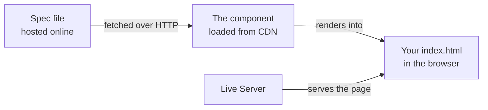
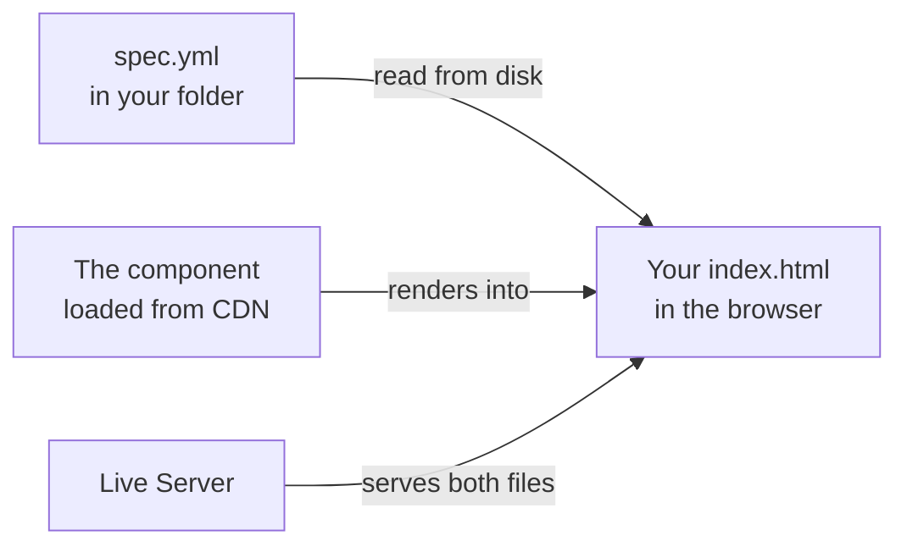
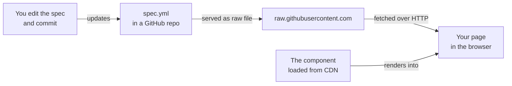
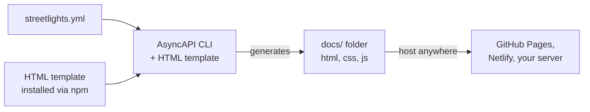

# The lazy way to keep your API docs in sync

This is the demo repo for my APIConf workshop.

The whole idea is simple: your spec file is the source of truth, and everything else, which includes your docs especially, should come from it.

You write the spec once, and the docs show up wherever you need them without you copying anything around by hand.

This README walks through the four ways I got that working during prep.

Each one is a little different, and each one has its own reason for existing.

I'll show you what each method is, how to get it running, the things you can poke at once it's up, and a diagram of how the whole thing is wired.

At the bottom I've put them side by side so you can see how they differ at a glance.

If you're following along in the workshop, you don't need to be a developer for most of this. The hardest tool you'll touch is your terminal, and only for the last method.

## What you need before you start

1. **Code Editor**: You'll want a code editor. I use VS Code, and the steps here assume it.

2. **Live Server Extension**: You'll also want the Live Server extension for it, which is a one-click way to serve a page locally. Grab it from the extensions panel in VS Code, search "Live Server" by Ritwick Dey, and install it.

3. **Node.js**: For the last method, you'll need Node.js version 20 or higher. If you don't have it, get it from nodejs.org. This will be flagged again when we get to that method.

4. **GitHub Account (Optional)**: If you want to host a spec on GitHub for method three, you'll need a GitHub account.

## Method 1: Plain HTML

This is the simplest version.

It's one HTML file and nothing to install. You load the AsyncAPI component from a public CDN, drop a div on the page, and tell the component to render a spec into it.

### How to get it working

Create a file called `index.html` and put this in it:

```html
<!DOCTYPE html>
<html>
<head>
  <link rel="stylesheet" href="https://unpkg.com/@asyncapi/react-component@latest/styles/default.min.css">
</head>
<body>
  <div id="asyncapi"></div>

  <script src="https://unpkg.com/@asyncapi/react-component@latest/browser/standalone/index.js"></script>
  <script>
    AsyncApiStandalone.render({
      schema: {
        url: 'https://raw.githubusercontent.com/asyncapi/spec/v2.0.0/examples/2.0.0/streetlights.yml',
        options: { method: "GET", mode: "cors" },
      },
      config: {
        show: { sidebar: true }
      },
    }, document.getElementById('asyncapi'));
  </script>
</body>
</html>
```

Open the file in VS Code, and click "Go Live" in the bottom-right corner. That starts Live Server and opens the page on a proper `http://127.0.0.1:5500/...` address, which is allowed to fetch the spec. Once it loads, you'll see the Streetlights docs render with a sidebar.

### Things to play with

Once it's up, change the `url` to point at a different spec. There's a folder of examples on the [AsyncAPI spec repo](https://github.com/integrational/asyncapi-spec/tree/master/examples/2.0.0), and swapping the URL changes the docs completely without you touching anything else on the page. That's the core idea in miniature.

Flip `sidebar: true` to `false` and watch the navigation disappear. That `config` object has other switches too, you can hide the servers, the operations, the messages, the schemas. Have a play and see what each one does.

For instance, you can:

- Hide the sidebar: `config: { show: { sidebar: false } }`
- Hide the servers: `config: { show: { servers: false } }`
- Hide the operations: `config: { show: { operations: false } }`

### How it's wired



The page pulls two things from the CDN, the component's code and its stylesheet, and it pulls the spec from wherever the URL points. Everything happens live, in the browser, when the page loads.

### Where it's useful

This is for quick jobs like prototype, an internal wiki page, a CodeSandbox, anywhere you can't or don't want to run a build step. It's also the easiest version to explain to someone who's never seen AsyncAPI, which is exactly why I open with it.

## Method 2: Local spec file

This is the same as method one, but instead of fetching the spec off the internet, you keep it in a file right next to your HTML.

This is important because it's the first time you're working with your own spec that you can edit and see change.

### How to get it working

Save your spec as a file next to `index.html`. Call it something like `spec.yml`. You can copy the contents of the Streetlights example into it to start, then edit the title or description so you'll be able to spot your own change.

Then point the component at that local file instead of a URL.

Change the `schema` block to this:

```html
schema: {
  url: 'spec.yml',
},
```

Notice I dropped the `options` line here. In method one we had `mode: "cors"` in there, which is correct when you're fetching from a different website.

But for a local file sitting in the same folder, forcing CORS mode makes the browser reject the request. So for local files, leave the options off.

Same rule as before applies: open it through Live Server, not by double-clicking. A local file still needs to be served over `http://` for this to work.

### Things to play with

This is where it gets fun, because now the spec is yours.

Open `spec.yml`, change the title, save it, and watch Live Server refresh the page with your change.

You can add a new channel or rename a message and every edit loads up when you save.

### How it's wired



The difference from method one is that the spec now lives on your machine, in the same folder Live Server is serving. The component still comes from the CDN, but the spec is local.

### Where it's useful

This is how you'd work while you're writing or editing a spec. Everything's local, the feedback loop is instant, and you're not depending on anything being online except the component itself.

## Method 3: Spec hosted on GitHub

This is an actual usecase.

You put your spec in a GitHub repo, and your page reads it from there.

Now the spec lives in version control where your engineers already work, its history is tracked, and any number of pages can read from the same file.

When you change the spec on GitHub, every page that points at it shows the change.

### How to get it working

First, get your spec onto GitHub.

Two easy ways:

- You can make a Gist: go to gist.github.com, create a public gist with your spec, and you're done.
- Or you can put it in a proper repo, which feels closer to how a real team works.
 
Either way, once the file is up, open it on GitHub and click the "Raw" button, then copy the URL from your address bar.

That raw URL has to be a `raw.githubusercontent.com` URL, not the normal `github.com/.../blob/...` one. The normal one serves a whole web page with the GitHub interface around your file, and the component chokes trying to read that as a spec. 

The raw URL serves just the file itself, which is what you want. If you ever see a "this is not an AsyncAPI document" error, this mismatch is almost always why.

Then point your component at the raw URL:

```html
schema: {
  url: 'https://raw.githubusercontent.com/<your-username>/<your-repo>/main/spec.yml',
  options: { method: "GET", mode: "cors" },
},
```

Keep the `options` with `mode: "cors"` this time, because now you are fetching from a different website.

### Things to play with

Once your page is rendering the spec from GitHub, go back to GitHub, edit the spec file right there in the browser, change the title to something obvious, and commit it. Wait a few seconds, then refresh your page. You should see your change reflected in the docs.

**NOTE TO SELF:** The raw file URL is cached for a short while, so your edit might take thirty seconds or a couple of minutes to appear.

### How it's wired



### Where it's useful

It's useful in your marketing site, dev portal, internal wiki, with them all pointing at the same raw URL, and they all update together when the spec changes.

## Method 4: The AsyncAPI Generator

The first three methods render the docs live in the browser every time the page loads. But this one is not quite thesame.

The Generator is a command-line tool that reads your spec and produces a folder of finished files, a whole static docs site you can drop anywhere. It's basically plain HTML, CSS, and JavaScript sitting in a folder ready to host.

### What you need

This is the one method that needs Node.js, version 20 or higher, and a terminal. If you don't have Node, get it from nodejs.org, the LTS version.

### How to get it working

Make a clean folder for this so it doesn't tangle with your other demos:

```bash
cd ~/Desktop
mkdir asyncapi-generator-demo
cd asyncapi-generator-demo
```

Grab a spec to work with:

```bash
curl -o streetlights.yml https://raw.githubusercontent.com/asyncapi/spec/v2.0.0/examples/2.0.0/streetlights.yml
```

Next, run this:

```bash
npx -y @asyncapi/cli generate fromTemplate streetlights.yml @asyncapi/html-template -o ./docs
```

This might fail and this is the reason for the nerds in this session: 

```bash
The HTML template quietly depends on Puppeteer, which tries to download a copy of headless Chrome when it installs. That download can fail, and when it does, the whole generate command dies with a vague "Installation failed" message that tells you nothing. You don't actually need Chrome for generating docs.
```

The fix however is:

```bash
PUPPETEER_SKIP_DOWNLOAD=true npm install @asyncapi/html-template
```

Let that finish and rerun the command above:

```bash
npx -y @asyncapi/cli generate fromTemplate streetlights.yml @asyncapi/html-template -o ./docs
```

Because the template is already sitting on disk, the generator finds it and skips the whole download process.

When it finishes, run `ls docs` and you'll see an `index.html` plus `css` and `js` folders.

Open that `index.html` in your browser.

### Things to play with

Try the Markdown template instead of the HTML one. Swap `@asyncapi/html-template` for `@asyncapi/markdown-template` and you get Markdown output instead of a website, which is handy if you want to feed the docs into something like MkDocs.

Or you can take the `docs` folder and drop it somewhere like GitHub Pages, Netlify, Vercel, or into an existing docs site as static files. Since it's fully self-contained, it just works wherever you put it.

### How it's wired



Notice this runs once, on your machine, ahead of time. The other three methods render on every page load. This one bakes the docs into files, and then those files are just static, which is exactly what makes it a strong choice for production.

### Where it's useful

This is the production-flavored option. When you want fully static output you can serve from anywhere, with no runtime dependency on a CDN and no build tooling fighting you, this is the one.

## Useful links

The AsyncAPI project lives at [asyncapi.com](https://www.asyncapi.com/). A few things from their world that this demo uses or points at:

[AsyncAPI Studio](https://studio.asyncapi.com/) is a browser-based editor for writing specs with a live preview. 

The [AsyncAPI CLI](https://github.com/asyncapi/cli) is the tool behind method four. The [Generator](https://github.com/asyncapi/generator) is what turns a spec into files, and the [HTML template](https://github.com/asyncapi/html-template) and [Markdown template](https://github.com/asyncapi/markdown-template) are the two I mention. The [React component](https://github.com/asyncapi/asyncapi-react) is what does the live rendering in the first three methods.

If you want to go deeper, the [spec itself](https://www.asyncapi.com/docs/reference/specification/v3.0.0) is worth reading, and the community mostly hangs out in the [AsyncAPI Slack](https://www.asyncapi.com/slack-invite).

And if you write REST or GraphQL instead, the same idea has its own tools: Redoc, Scalar, and Swagger UI for OpenAPI, and GraphiQL and Apollo Explorer for GraphQL.
